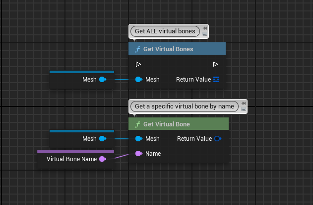

# A Small Plugin to access Virtual Bones from Blueprints

## Why?
A while ago, a question on the AnimState Discord server came up on whether it is possible to get more details about virtual bones from Blueprints.
Looking into the source, I saw that while the members of virtual bones are exposed to the reflection system, they are not exposed to Blueprints.
So you would need C++ just to query them in BP. 

Not anymore, all the work is done here! :D

## Features
- A wrapper struct that exposes Virtual Bones to Blueprints
- A BlueprintFunctionLibrary to query all or individual virtual bones of a skeleton
- Complete with hash function, so it can be used in maps and sets, and equality operator for wrapped and non-wrapped virtual bones

## Compatibility
I created the Plugin in UE5.3, but I assume it will also be valid in other versions, at least down to 5.0

Currently I have only Win64 as whitelisted platform since I just want quick builds and don't want to mess with other SDKs or similar, but it should still work, you'll just have to compile it yourself.